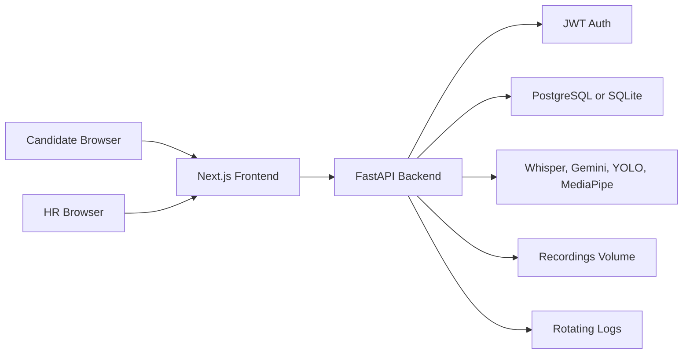

# VoxAssess AI

VoxAssess AI is a full-stack interview evaluation platform for candidate practice and HR-led live assessment. It combines FastAPI, SQLAlchemy, PostgreSQL/SQLite, Next.js, Whisper transcription, Gemini-assisted scoring, YOLO object detection, and MediaPipe eye-contact tracking.

## Architecture



## Tech Stack

| Layer | Technology |
| --- | --- |
| Frontend | Next.js 16, TypeScript, React 19, Tailwind CSS |
| Backend | FastAPI, SQLAlchemy 2, Alembic |
| Database | SQLite for local dev, PostgreSQL 15 for Docker/prod |
| AI/ML | faster-whisper, Gemini, YOLOv8, MediaPipe, spaCy, librosa |
| Auth | JWT, passlib bcrypt |
| Ops | Docker Compose, python-dotenv, Pydantic Settings, SlowAPI rate limiting |
| Logging | Python logging with console and rotating file output |

## Prerequisites

- Python 3.12 recommended
- Node.js 20 recommended
- Docker and Docker Compose for PostgreSQL setup
- FFmpeg for audio processing
- A spaCy English model: `python -m spacy download en_core_web_sm`

## Environment Variables

Backend settings live in `backend/.env`. Use `backend/.env.example`, `backend/.env.development`, or `backend/.env.production` as templates.

| Variable | Required | Description |
| --- | --- | --- |
| `SECRET_KEY` | Yes | JWT signing secret. Use a long random value in production. |
| `DATABASE_URL` | Yes | SQLite or PostgreSQL SQLAlchemy URL. |
| `STREAM_API_KEY` | For live video | Stream Video API key. |
| `STREAM_API_SECRET` | For live video | Stream Video API secret. |
| `GEMINI_API_KEY` | Optional | Enables Gemini scoring. |
| `ALLOWED_ORIGINS` | Yes | Comma-separated CORS origins. |
| `UPLOAD_DIR` | Yes | Temporary upload directory. |
| `RECORDINGS_DIR` | Yes | Persistent audio recording directory. |
| `LOG_DIR` | Yes | Log directory. |
| `MAX_UPLOAD_SIZE_MB` | Yes | Upload size limit. Defaults to 50. |

Frontend settings live in `frontend/.env.local`.

| Variable | Description |
| --- | --- |
| `NEXT_PUBLIC_BACKEND_URL` | Public backend API base URL. Defaults to `http://127.0.0.1:8000`. |

## Local Setup With SQLite

```bash
cd backend
python -m venv venv
venv\Scripts\activate
pip install -r requirements.txt
python -m spacy download en_core_web_sm
copy .env.development .env
alembic upgrade head
uvicorn main:app --reload
```

In another terminal:

```bash
cd frontend
npm install
copy .env.local.example .env.local
npm run dev
```

Open `http://localhost:3000`.

## PostgreSQL Migrations

Alembic is configured in `backend/alembic.ini` and reads `DATABASE_URL` from the backend environment through `backend/config.py`.

Run migrations manually:

```bash
cd backend
alembic upgrade head
```

Create a future migration after changing models:

```bash
cd backend
alembic revision --autogenerate -m "describe change"
alembic upgrade head
```

SQLite still works for lightweight development. PostgreSQL uses pooled connections and JSONB columns for queryable scoring/report payloads.

## Docker Setup

Production-like PostgreSQL stack:

```bash
docker compose up --build
```

Development stack with hot reload:

```bash
docker compose -f docker-compose.yml -f docker-compose.dev.yml up --build
```

The Docker stack starts:

| Service | Port | Notes |
| --- | --- | --- |
| `db` | internal 5432 | PostgreSQL 15 with persistent `postgres_data` volume |
| `backend` | 8000 | Runs Alembic migrations before FastAPI |
| `frontend` | 3000 | Serves the Next.js app |

Recordings persist at `backend/recordings`.

## API Summary

| Method | Endpoint | Purpose |
| --- | --- | --- |
| `GET` | `/health` | Backend health check |
| `POST` | `/users/signup` | Create candidate account, rate limited to 5/minute |
| `POST` | `/users/login` | JWT login, rate limited to 10/minute |
| `GET` | `/users/me` | Current user profile |
| `GET` | `/users/` | Paginated users list |
| `POST` | `/interviews/` | Create interview for current authenticated user |
| `GET` | `/interviews/` | Paginated interview list |
| `GET` | `/interviews/all` | Paginated HR interview list with relationships |
| `GET` | `/interviews/{id}` | Interview details |
| `POST` | `/transcribe` | Audio transcription, audio-only, 50MB max, rate limited to 10/minute |
| `POST` | `/analyze-answer` | Transcribe, score, and persist answer audio, rate limited to 10/minute |
| `POST` | `/monitor-frame` | Proctoring frame analysis, rate limited to 60/minute |
| `POST` | `/finalize-interview/{id}` | Final score persistence and session-state cleanup |
| `POST` | `/live-sessions` | Create live meeting ID |
| `GET` | `/stream/token` | Stream Video token |
| `GET` | `/export-dataset` | Export evaluation data as JSON or CSV |

## Security And Reliability

- Configuration is centralized in Pydantic settings and loaded from `.env`.
- PostgreSQL uses connection pooling with `pool_pre_ping`.
- File uploads are restricted to audio MIME types and extensions.
- Upload filenames are sanitized before disk writes.
- Request rate limits protect auth, transcription, scoring, and monitoring endpoints.
- Request logging includes method, path, user ID, status, and response time.
- Runtime logs rotate at 10MB with 5 backups under `backend/logs`.
- Per-interview proctoring state is isolated and thread-safe.

## Known Limitations

- In-memory WebRTC signaling and meeting alerts are not distributed across multiple backend replicas.
- The initial HR session creator assigns the interview owner from the authenticated JWT. Inviting a separate candidate account requires a future candidate invitation workflow.
- YOLO and Whisper model downloads can make first startup slow.
- The local SQLite path is intended for development only.

## Future Scope

- Candidate invitation entities and email delivery.
- Persisted distributed signaling via Redis.
- Admin RBAC and audit logs.
- Richer evaluation rubrics by job family.
- Background workers for transcription/scoring.
- Cloud object storage for recordings.
